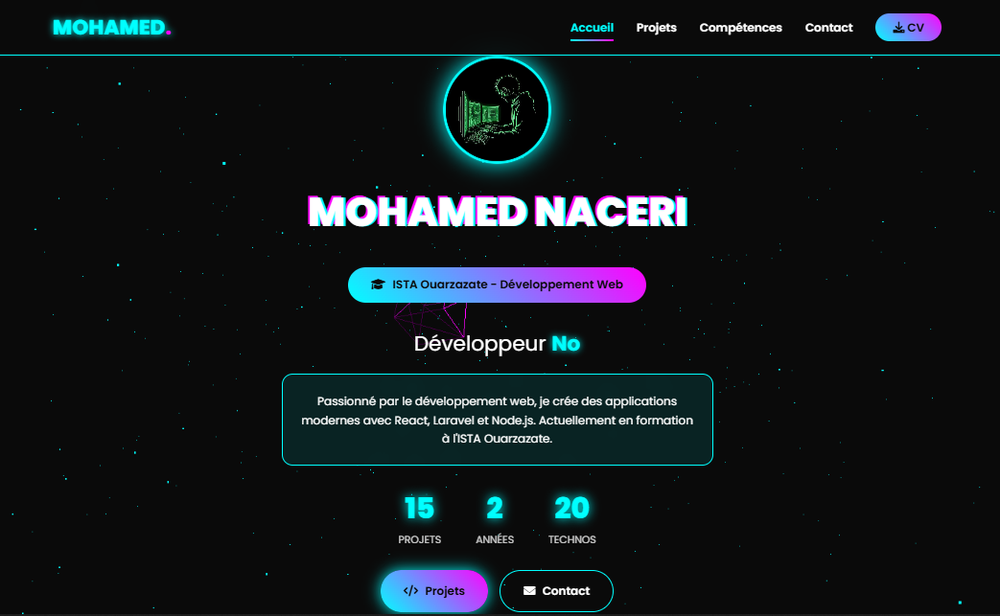
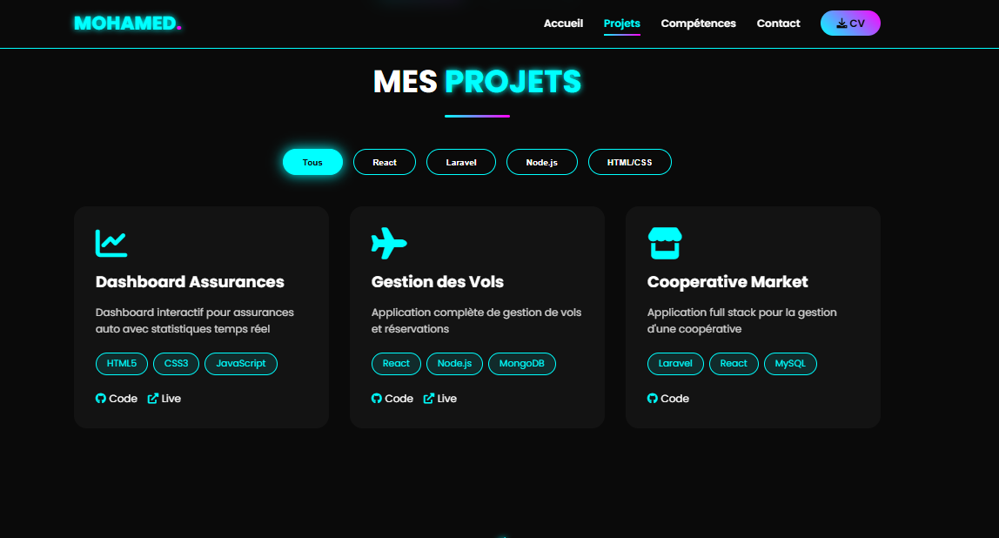
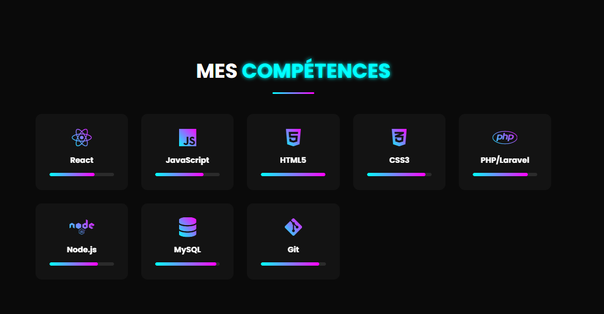

# 🚀 Mohamed Naceri - Portfolio 3D

Portfolio personnel moderne et interactif avec animations 3D, effets visuels avancés et design futuriste.

## 🖥️ Aperçu du site



## 🖥️ Aperçu du site



## 🖥️ Aperçu du site



---

## ✨ Fonctionnalités

- 🎬 Loading Screen animé avec barre de progression
- 🌌 Animation 3D avec Three.js
- 🎨 Dark / Light Mode
- 🖥️ Design Responsive (Mobile / Tablet / Desktop)
- 🧠 Animation Typing automatique
- 📊 Compteurs animés
- 🔍 Filtrage dynamique des projets
- 📄 Génération automatique de CV
- 📬 Formulaire de contact interactif
- ⚡ Smooth Scroll & Navigation active

---

## 🛠️ Technologies Utilisées

- HTML5
- CSS3 (Animations, Variables CSS)
- JavaScript Vanilla
- Three.js
- Font Awesome

---

## 📁 Structure du Projet
```
portfolio-3d/
│
├── index.html
├── style.css
├── script.js
├── img.jpg
└── README.md
```


---

## 🚀 Installation

1. Cloner le repository :

```bash
git clone https://github.com/username/portfolio-3d.git
```


Ouvrir le dossier :
```
cd portfolio-3d
```

Lancer le projet :

Ouvrir simplement index.html dans le navigateur.
----
🎯 Aperçu

## Ce portfolio présente :

Mes projets Full Stack (React, Laravel, Node.js)

Mes compétences techniques

Mes informations de contact

Une expérience utilisateur immersive avec effets 3D
----
## 📬 Contact

📧 Email : naceri.mohamed12@gmail.com

💻 GitHub : https://github.com/nacerimohamed

🔗 LinkedIn : mohamed Naceri
----
## 📜 Licence

Projet personnel - Usage libre pour inspiration.
----
## ⭐ Auteur

Mohamed Naceri
Développeur Full Stack
ISTA Ouarzazate